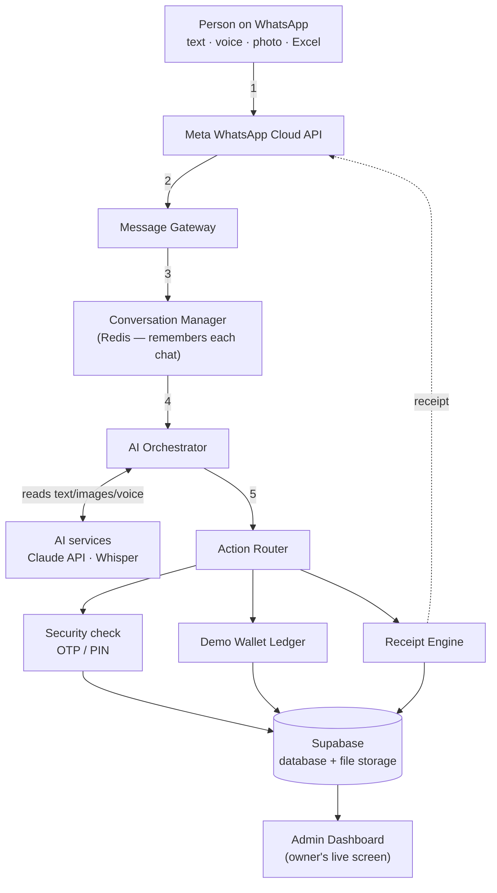
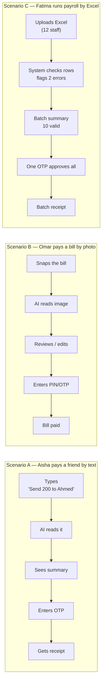

# GuildPay AI — Implementation Guide (plain English)

A WhatsApp-based QAR payment assistant for Qatar. Users type, speak, snap a photo, or upload a
spreadsheet to pay — the assistant reads it, shows a summary, asks for a security code, and returns
a receipt. Behind the friendly chat: an AI that understands requests, a security step, a wallet
ledger, a receipt engine, and an owner's dashboard. **No real money moves in the demo — a simulated
wallet is used, and a licensed partner is connected later via one well-defined "plug."**

## Architecture (flow)

## Three end-to-end user journeys

## Setup summary

**WhatsApp (Meta Cloud API).** Two environments. **Test** (free): create a Meta developer account,
add the WhatsApp product, use the free test number (messages up to 5 approved recipients), connect a
webhook to your server. Build the whole MVP here. **Production** (launch): verify the business (start
day one — slowest step), add a real business number, get a display name approved, use a permanent
token, and set up message templates.

**AI layer.** Recommended: **Claude API** (understanding + image reading) + **Whisper** (voice→text).
Fastest to build, ~$30–80 for the demo phase, no special hardware. ChatGPT/OpenAI is a fine
alternative. Local/self-hosted AI is a strong Phase-2 sovereignty story but too heavy for the MVP.
The system is built so the AI provider can be swapped without rewriting flows.

**Backend & tools.** Node.js backend (the engine) · Supabase (the memory: database + file storage) ·
Redis/Upstash (short-term session memory) · Claude + Whisper (the brain) · Next.js dashboard (owner's
screen) · Railway/Hetzner hosting (always-on server) · a domain name with HTTPS.
**Running cost during the MVP: ~$70–150/month.**

## End-to-end flow (one payment)
1. Person sends a message (typed, spoken, photo, or spreadsheet).
2. WhatsApp passes it to the system via the Cloud API.
3. System checks who it is and where the chat is up to (new users are onboarded).
4. Voice/photo is converted first (voice→text; photo→payment details).
5. The AI extracts amount, recipient, reason — asking a question if anything is unclear.
6. A clear summary is shown with Confirm / Edit / Cancel.
7. Security step: OTP or PIN. **Nothing moves without this.**
8. The wallet ledger updates.
9. A receipt is created and sent back into the chat, saved to history.
10. The owner's dashboard updates live.
11. The person can ask the AI for help anytime (receipt, failed payment, freeze account).

> The polished versions with full styling are in the delivered `.docx` / `.html` guide.
> This Markdown copy exists so the coding agents can read it as project context.
